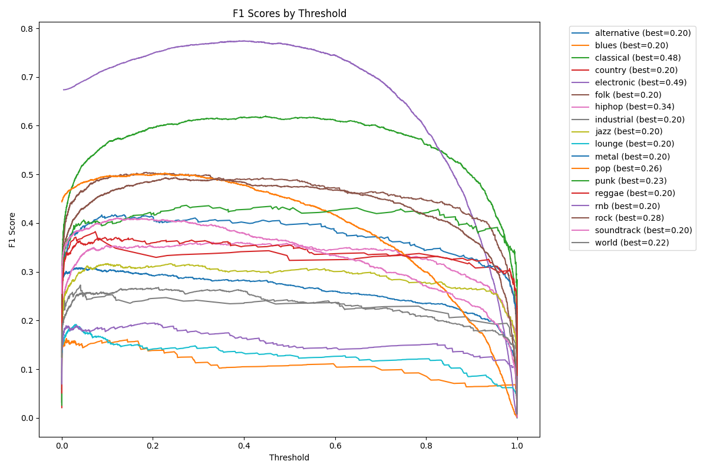

# AI Music Categorizer

Predicts the **genre(s)** and **mood** of a song from its audio. Tracks are turned into a 432-dimensional vector of timbre, harmony, and rhythm features with `librosa`. Two PyTorch models then classify them:

- **Genre:** multi-label, 18 genres. A track can be several genres at once, like `rock` + `alternative`.
- **Mood:** single-label, 25 moods/themes, like `relaxing`, `epic`, or `sad`.

Both models were trained on about 55k tracks from the [MTG-Jamendo dataset](https://github.com/MTG/mtg-jamendo-dataset). The trained models are included, so you can run predictions right away.

```text
$ python scripts/predict.py song.mp3
Running prediction for: song.mp3
Predicted Mood: relaxing
Predicted Genres: ['electronic']
```

---

## How it works

```
audio file ──► librosa feature extraction ──► StandardScaler ──┬──► Genre model ──► per-genre thresholds ──► genres
 (first 30s)      (432-dim vector)                              └──► Mood model  ──► softmax / argmax     ──► mood
```

### Features (`music_categorizer/features.py`)
Each feature is averaged over time into one vector:

| Group | Features | Dims |
|---|---|---|
| Timbre / spectral | MFCC (20), spectral contrast (7), spectral flatness (1), zero-crossing rate (1) | 29 |
| Harmony | Chroma CQT (12), tonnetz (6) | 18 |
| Rhythm | Tempogram (384), tempo (1) | 385 |

During training, the features for each track are cached to `data/features/` as `.npy` files. Extraction runs in parallel with `joblib`, and the number of workers scales with available RAM.

### Genre model (`MusicGenreModel`)
- Dense layer (2048) → BatchNorm → Dropout, followed by a **learned sigmoid attention gate** over the hidden features.
- **Dedicated sub-branches** for genres that are hard to separate (metal, punk, blues). Their outputs are concatenated back into the main path before the output layer.
- Handling class imbalance:
  - Weighted BCE loss using smoothed inverse-frequency class weights, with hand-tuned per-genre boosts on top.
  - Multi-label stratified 80/20 train/val split (`iterative-stratification`).
  - A **separate decision threshold for each genre**, chosen from its precision-recall curve on the validation set. Thresholds are adjusted for label frequency and clipped to [0.2, 0.8].
- Early stopping on validation macro-F1.
- An optional **10-model ensemble** (`scripts/train_genre_ensemble.py`) averages the predicted probabilities of all members.

The raw Jamendo tags include 226 different genre and subgenre labels. `music_categorizer/genres.py` maps them onto 18 main genres; for example, `deephouse` becomes `electronic` and `punkrock` becomes `punk`. Tracks with no mappable genre are dropped.

### Mood model (`MoodClassifier`)
A 3-layer MLP (1024 → 256 → classes) with BatchNorm and dropout, trained with cross-entropy. Only moods with at least 500 examples are kept, which leaves 25 classes.

---

## Results



| Model | Metric | Score |
|---|---|---|
| Genre (18 classes, multi-label) | Macro F1 / Micro F1 | 0.852 / 0.828 |
| Mood (25 classes) | Accuracy / Macro F1 | 0.698 / 0.701 (majority-class baseline: 0.083) |

> **Note:** These numbers come from `scripts/evaluate_*.py`, which scores the **full labeled dataset**. That includes the 80% the models were trained on, so they overestimate how well the models do on unseen songs. Reporting on only the held-out validation split is next on the to-do list.

The per-track predictions behind these numbers are in [`results/`](results/).

---

## Project structure

```
ai-music-categorizer/
├── music_categorizer/          # Core library
│   ├── paths.py                # All file paths, anchored to the repo root
│   ├── genres.py               # Main genres + subgenre → genre mapping
│   ├── features.py             # librosa feature extraction (+ on-disk cache)
│   ├── data.py                 # Load Jamendo tags, filter labels, build X / y
│   ├── models.py               # MusicGenreModel, MoodClassifier, WeightedBCELoss
│   ├── genre_trainer.py        # Genre training loop + threshold tuning
│   ├── mood_trainer.py         # Mood training loop
│   └── utils.py
├── scripts/                    # Entry points
│   ├── predict.py              # Predict genre + mood for a single audio file
│   ├── train_genre.py
│   ├── train_mood.py
│   ├── evaluate_genre.py
│   ├── evaluate_mood.py
│   ├── train_genre_ensemble.py
│   ├── evaluate_genre_ensemble.py
│   └── debug/                  # Diagnostics used during development
├── models/                     # Trained weights, label binarizers, scalers, thresholds
│   ├── genre/
│   └── mood/
├── results/                    # Evaluation outputs (predictions, plots)
├── data/
│   └── raw_30s_cleantags.tsv   # MTG-Jamendo track metadata + tags
├── requirements.txt
└── pyproject.toml
```

---

## Setup

Requires Python 3.10+ (developed on 3.12).

```bash
git clone https://github.com/Yusufff7/ai-music-categorizer.git
cd ai-music-categorizer
python -m venv venv
venv\Scripts\activate        # Windows  (macOS/Linux: source venv/bin/activate)
pip install -r requirements.txt
pip install -e .             # makes the music_categorizer package importable
```

A CUDA GPU is used automatically if one is available, but it isn't required. `scripts/debug/gpu_test.py` checks whether PyTorch can see your GPU.

## Usage

### Predict a single song
Works with any audio format librosa can read (mp3, wav, flac, ...):
```bash
python scripts/predict.py path/to/song.mp3
```

### Retrain or evaluate
Training needs the MTG-Jamendo audio, which is too large to include here:

1. Download the `raw_30s` audio with the [MTG-Jamendo download script](https://github.com/MTG/mtg-jamendo-dataset).
2. Place it in `data/audio/` so that paths match the TSV, e.g. `data/audio/14/214.mp3`.

Then run:
```bash
python scripts/train_genre.py      # writes to models/genre/
python scripts/train_mood.py       # writes to models/mood/
python scripts/evaluate_genre.py   # writes to results/genre/
python scripts/evaluate_mood.py    # writes to results/mood/
```

The first run extracts features for every track, which takes a while. Later runs load the cached features from `data/features/`.

> Training overwrites the committed models in `models/`. Use `git checkout models/` to restore them.

## Tech stack
PyTorch · librosa · scikit-learn · pandas · NumPy · joblib · matplotlib

## License
MIT. See [LICENSE](LICENSE).
